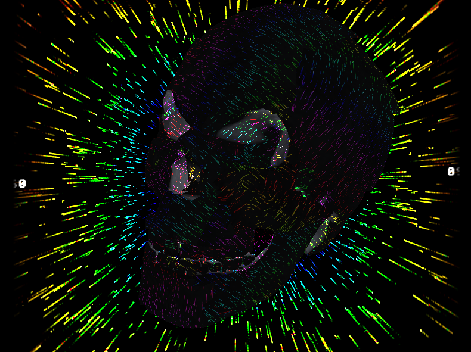

CWOBJ : C single-header Wavefront OBJ loader
=====

Support for indices, vertices, texcoords, normals, colors with indices unification (geometry data duplicata removal), TRIANGLES ONLY (you must triangulate your models before using this!)

Limited support for materials; parse multiple materials but select/assign a single material to the final mesh.

Has average speed, slow with complex models.

Has support for automatic loading of textures but you must provide the function which will load the image file and create the texture.

There is a light geometry library bundled with some useful functions and data structure such as `cwobj_geomMerge` which can be useful to bootstrap some experiments.

The header is documented with Doxygen.

This was extracted and enhanced from my old OpenGL 1.x engine : https://github.com/grz0zrg/M3D

### Example

```c
#include "cwobj.h"

cwobj *cube_mesh = cwobj_load("bad_skull.obj", NULL); // last argument can be your texture loading callback
cwobj_geo *skull_geo = cube_mesh->geometry; // get geometry
cwobj_geo *skull_mat = cube_mesh->material; // get material

/* // Then you can do something like this to access the data (see the header file for more informations) :

GLuint cube_vao = fbg_glfwCreateVAO(cube_geo->indice_n, &cube_geo->indice[0], sizeof(CWOBJ_INDICE_TYPE), cube_geo->vertice_n, &cube_geo->vertice[0], cube_geo->texcoord_n, &cube_geo->texcoord[0], cube_geo->normal_n, &cube_geo->normal[0], cube_geo->color_n, &cube_geo->color[0]);
*/
```


### Screenshots

[Example usage (indices, vertices, UV, normals)](https://github.com/grz0zrg/fbg/blob/arm64/custom_backend/glfw_example_advanced.c)

